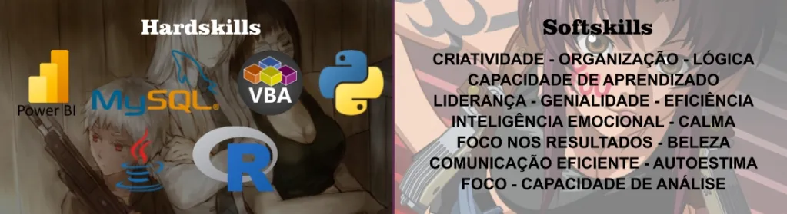

# 🖤 Ṉ̵̢̫̝̱͌̑̓̎͘e̷̟̓̄̋r̵͓̟̪̂͆ǒ̴̧͓̬͓̮͐̈́  H̷̲͉͇̞͂͛͋a̸̛̝̪̬̽̅̄z̸̘̰̘͐͂̿͝͠i̸̫͉̦̅̒̀̂ě̷̛͖̺̾ļ̷̙͙̙͋̐͛ 🖤

### The Almighty Sovereign of Bliss, The Overlady, The Supreme Governor of Passion, The Ruler of all Hugs 

Nascida no dia 23 de Janeiro de 2003, certamente era a bebê mais linda de toda a maternidade. Todos ficaram imediatamente encantados com tamanha perfeição, mal imaginando que esta bebê estava destinada a se tornar 𝐎 𝐀𝐧𝐭𝐢𝐜𝐫𝐢𝐬𝐭𝐨, 𝐎 𝐀𝐛𝐚𝐝𝐨𝐦, 𝐀 𝐃𝐞𝐬𝐭𝐫𝐮𝐢𝐝𝐨𝐫𝐚, ou apenas, 𝐍𝐞𝐫𝐨 𝐇𝐚𝐳𝐢𝐞𝐥, seu glorioso e majestoso nome.

## Technologies
### Languages

### Frameworks / Libraries

### IDE
        
          

### Databases

          

### Others

          

## Skills
Buscando masterizar todas as habilidades necessárias para dominação mundial, nossa Deusa das Trevas está sempre em constante evolução e numa jornada eterna pelo aprendizado, sejam em habilidades técnicas ou interpessoais.

## Contacts

